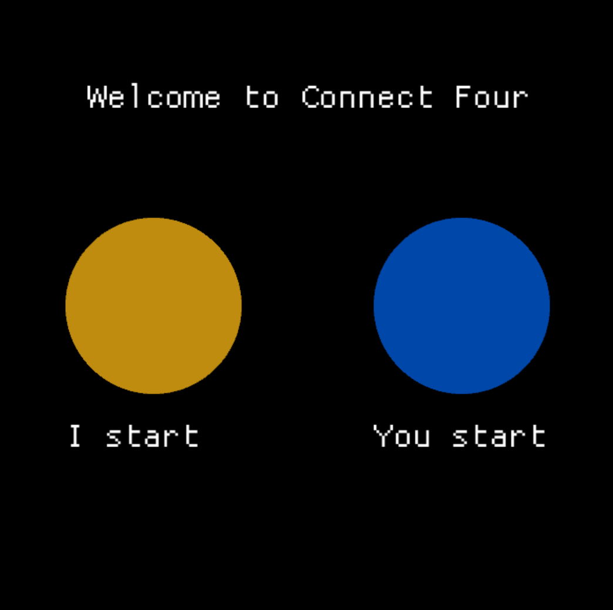
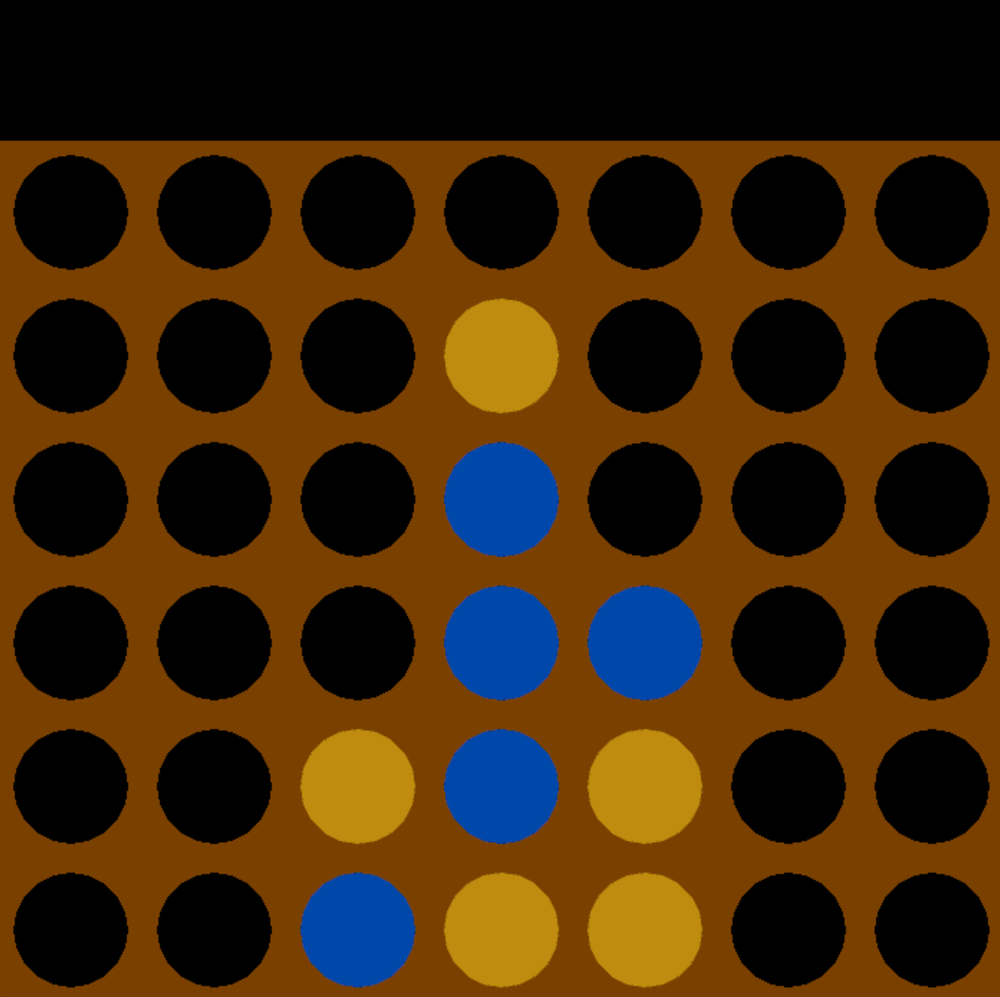
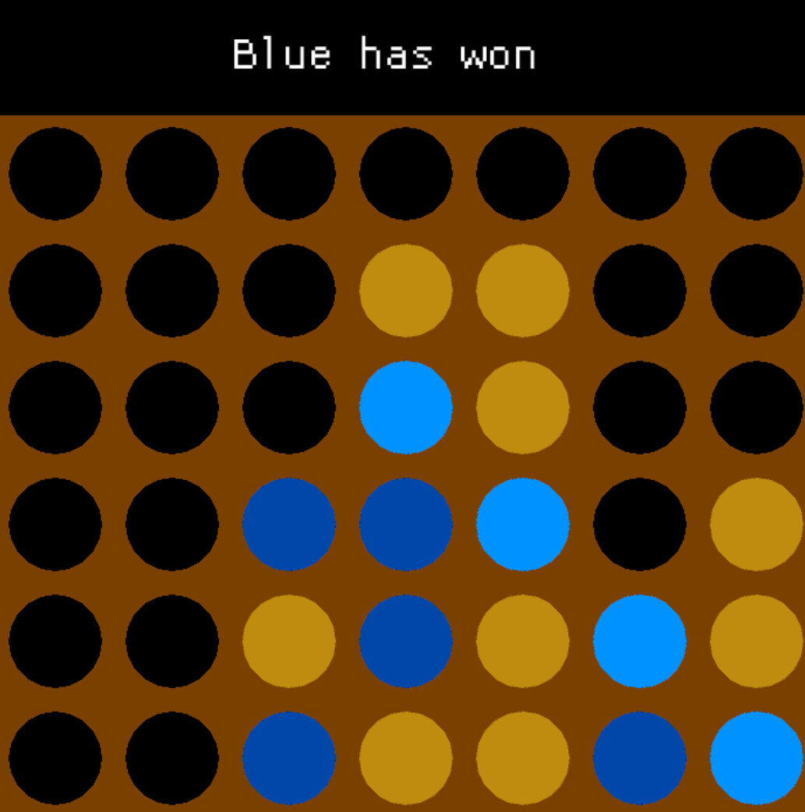

# Connect Four in Rust

## Overview
This project implements the classic Connect Four game with a sophisticated AI opponent. The AI uses a Negamax algorithm enhanced with alpha-beta pruning and transposition tables to play at a strong level. The game features smooth animations and is rendered using pure OpenGL, with AI calculations performed asynchronously to maintain responsive gameplay.

Full source code documentation can be generated with:
```
cargo doc --open
```

## How to Play
### Starting a Game
When you launch the program, you'll be presented with a choice screen where you select your color by clicking on either the yellow or blue circle. Yellow always moves first.

<figure>
    
    <figcaption><b>Choose your color to begin</b></figcaption>
</figure>

### During Gameplay
Make your move by clicking anywhere in the column where you want to drop your piece. Your stone will animate falling into position while the AI calculates its response in the background.

<figure>
    
    <figcaption><b>Playing against the AI</b></figcaption>
</figure>

### Game End
When the game concludes, the winning combination is highlighted on the board, and the result is displayed with an icon above. Click anywhere to return to the color selection screen for a new game.

<figure>
    
    <figcaption><b>Game finished with highlighted winning stones</b></figcaption>
</figure>

## Architecture
The program is organized into three main modules:

* **state_system**: Manages the game's state machine, coordinating transitions between menu, gameplay, and game-over states.
* **render_system**: Handles OpenGL rendering and animations, including the smooth stone-dropping effects.
* **board_logic**: Contains the game board representation and AI implementation.

## Technical Highlights

### Asynchronous AI Computation
In the `computer_calculation` state, AI calculations run in a separate thread using Rust's `mpsc` channels. This allows the opponent's stone to animate while the AI computes its next move, keeping the interface responsive. The threading approach was chosen over async/await (tokio) as it proved simpler and more appropriate for this use case.

### Advanced Rendering with Stencil Buffers
The board rendering presents an interesting challenge: displaying circular holes where stones can be placed while showing falling pieces that should remain visible as they drop. The solution uses a multi-pass rendering approach:
1. First, render any falling stones
2. Render the hole positions into the stencil buffer only
3. Finally, render the board rectangle, masking out areas marked in the stencil buffer

This technique ensures falling stones are visible while maintaining clean circular cutouts in the board.

### Efficient Bitboard Representation
The game state is encoded using 64-bit integers, enabling highly efficient parallel operations through bitwise logic. Key concepts include:

**Sentinel Guards**: The flat bitboard representation could allow bit shifts to wrap around into adjacent rows. Sentinel bits act as guardrails, preventing this issue. See the `clip_shift` function for implementation details.

**Symmetry Detection**: Connect Four is symmetric along the vertical axis. The `SymmetryIndependentPosition` structure ensures that mirror-image board positions are recognized as equivalent in the transposition table, roughly doubling its effectiveness.

### AI Implementation

The core AI algorithm resides in the `alpha_beta` module and maintains two transposition tables:
- **Current table**: Stores positions evaluated during the current move search
- **Previous table**: Contains evaluations from the last move, reused for move ordering heuristics

**Algorithm Flow**:

1. `evaluate_next_move` checks if the current position exists in the transposition table
2. If not cached, `get_pre_sorted_move_list` analyzes all available moves:
  - Immediate wins/losses and draws are identified and handled without recursion
  - Positions found in the transposition table are stored with their evaluations
  - Remaining moves are sorted by promise (using old transposition table values or static heuristics)
3. The sorted move list is then evaluated recursively with alpha-beta pruning
4. A small discount factor (0.99999) encourages the AI to prefer quicker wins and delay losses, making its endgame behavior more natural

**Move Ordering Strategy**:
The old transposition table, while not perfectly accurate for the current search depth, provides better move ordering than pure heuristics. This significantly improves alpha-beta pruning efficiency.

### Heuristic Evaluation
The `heuristic` module implements a lightweight position evaluator that balances accuracy with computational efficiency. It considers:
- Open three-in-a-row patterns (potential threats)
- Two-in-a-row combinations
- Control of center columns (strategically valuable)

The heuristic is designed to be fast enough for evaluating thousands of positions per second while providing sufficient guidance for move ordering.

## Rust Language Features

This project demonstrates several Rust concepts:

- **Custom Debug Macros** (`debug_macros`): Domain-specific assertion macros for board coordinate validation
- **Trait Objects** (`Box<dyn GameState>`): Dynamic polymorphism for the state machine pattern
- **Const Functions** (`bit_board_coding`): Compile-time computation of bitmasks and lookup tables
- **Multithreading** (`std::sync::mpsc`): Inter-thread communication for asynchronous AI computation
- **Zero-cost Abstractions**: Bitboard operations compile to efficient SIMD instructions

## Getting Started

### Installing Rust

**Linux/macOS**:
```bash
curl --proto '=https' --tlsv1.3 https://sh.rustup.rs -sSf | sh
```

**Windows**:
Download the installer from [rust-lang.org/tools/install](https://www.rust-lang.org/tools/install)

In both cases you get three key tools:
- `rustup`: Manages Rust versions and updates
- `rustc`: The Rust compiler
- `cargo`: Package manager and build system (your primary interface)

### Building and Running

Clone the repository and navigate to the directory containing `Cargo.toml`, then:
```bash
# Generate and open documentation
cargo doc --open

# Build and run in release mode (optimized)
cargo run --release

# Build for development (faster compilation, slower runtime)
cargo run
```

**Note**: Always use `--release` for normal gameplay, as the AI search depth is tuned for optimized builds.

## License
This project is licensed under the MIT License - see the [LICENSE](LICENSE) file for details.